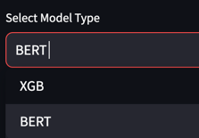

# Movie Genres prediction
You can use my application to find your movie genres.
All you need to do is entering my website:
https://moviegenresclassifier.streamlit.app/

choose your preffered model:

Enter the movie summary:

Hit "Predict":

### Project Overview: Milestones

1. **Data Initial Preprocessing**: This is the first stage of the process where the structure of the samples is understood, the data is converted into a more efficient CSV format, and "blanks" in the data (missing fields for samples) are filled with empty values.

2. **Exploratory Data Analysis (EDA)**: During this phase, the data is scrutinized to discover patterns and common features, leading to a comprehensive understanding of the data and guiding the following steps.

3. **Genre Focus Determination**: Based on the insights from the EDA, the most frequently occurring genres are pinpointed for prediction. Two methods were tested for this purpose: the Elbow Method, which utilizes K-means clustering, and the Statistical Significance Method.

4. **Data Preprocessing**: The clean and filter data pipeline is built to ready the data for training. The data is then vectorized using TF-IDF and multi-label binarization, equipping it for the classification task.

5. **Model Training**: The models are trained using both a Machine Learning approach and a Transformer-based approach.

6. **Model Evaluation**: The models are evaluated using precision, recall, and F1 scores over different thresholds to measure their performance.

7. **Model Deployment**: Finally, the models are deployed for inferencing, ready to predict movie genres based on provided input data.

## Model Comparison - ML approach

Two different multi-label text classification models were evaluated in this project - an XGBoost model with a Classifier Chain and a Stochastic Gradient Descent (SGD) model with a One vs Rest classifier.

Based on the evaluation reports generated using different thresholds, the following observations can be made:

### XGBoost Model with Classifier Chain
This model demonstrates strong performance across varying thresholds. However, as the threshold increases, we observe a decrease in recall while precision improves. This indicates that the model becomes more confident in its predictions but at the expense of missing some true positives.

### SGD Model with One Vs Rest Classifier
Similar to the XGBoost model, the SGD model also shows an improvement in precision with increasing threshold, but with a decrease in recall. The trend suggests that this model may also prioritize confident predictions over capturing all true positives.

In general, both models exhibit similar trends across thresholds. The choice between these models could be influenced by specific use cases. If high confidence in predictions is more desirable, a higher threshold can be chosen at the cost of potentially missing some positive instances. On the other hand, if the aim is to capture as many positive instances as possible, a lower threshold might be more appropriate, albeit with less confidence in the predictions.

## Exploratory Data Analysis Notebook: exploratory_data_analysis.ipynb

This Jupyter notebook contains the Exploratory Data Analysis (EDA) performed on the movie dataset. The EDA is an essential step in the project as it helps to understand the structure and properties of the data before building the machine learning models.

### Data Analysis

The main part of the notebook is dedicated to analyzing the data. This includes:

- **Visualizations**: The notebook uses various types of plots to visualize the data and gain insights. For example, bar plots, histograms, and pie charts might be used to show the distribution of categorical data.

- **Statistical Analysis**: The notebook performs statistical analysis on the data

- **Multi-label Analysis**: Since the task is a multi-label classification problem (predicting the genres of a movie), the notebook analyzes the distribution of genres across the movies and visualizes this information.

## Finding Outliers in Genres Notebook: find_outlayers_genres.ipynb

This Jupyter notebook contains the analysis performed on the movie dataset to find outlier genres. The goal of this analysis is to identify the genres that are not commonly used in the dataset, as they might impact the performance of the multi-label classification model.

### Genre Distribution Analysis

The notebook contains a thorough analysis of the genre distribution in the dataset. This includes:

- **Counting Genre Frequencies**: The notebook counts the frequency of each genre in the dataset to understand the distribution of genres.

- **Visualizing Genre Distribution**: The notebook visualizes the genre distribution using bar plots and line plots to better understand the skewness in the genre distribution.

### Outlier Detection

The notebook performs outlier detection on the genre distribution. This is an essential step to identify the genres that are not frequently used in the dataset (outliers). The notebook uses techniques like:

- **Elbow Method**: This method is used to find a point in the distribution of genres after which the frequency of genres drops drastically. This point can be used as a threshold to filter out the outlier genres.

- **Statistical Analysis**: The notebook also performs statistical analysis, like calculating z-scores, to identify outliers.

# Data Preprocessing

## Json lines to CSV Conversion
This script purpose is to preprocess the raw data and convert it into a usable format for further analysis and model training.

The script reads a .json file where each line is a separate JSON object, corresponding to a movie. Each JSON object has multiple fields, representing different characteristics of the movie. The fields include 'countries', 'feature_length', 'genres', 'languages', 'movie_box_office_revenue', 'plot_summary', 'release_date', and 'title'. 

### read_json_lines_file function

The `read_json_lines_file` function reads the raw .json file, and for each movie, it sets default values for any missing fields and transforms dictionary-type fields into list-type fields by extracting their values. 

### json_lines_to_csv function

After the raw data is processed, the `json_lines_to_csv` function is used to convert the processed data into a DataFrame and save it as a .csv file for easier handling in the later stages of the project.

In the main part of the script, the `read_json_lines_file` and `json_lines_to_csv` functions are called to process the raw data and save the result as a .csv file.

**Note**: You should replace the `../data/train.json` and `../data/processed_data.csv` with the actual paths to your raw data file and the .csv file you want to create, respectively.
## Class: DataPreprocessor

The `DataPreprocessor` class is a key part of the project, responsible for reading in the raw movie data and preprocessing it for further analysis and model training.

The class is initialized with a `data_path` argument that specifies the location of the input CSV data file.

### __post_init__ method

The `__post_init__` method is automatically called after the class is initialized. It reads the data from the CSV file into a pandas DataFrame and makes a deep copy of the DataFrame for preprocessing.

### filter_genre_list method

The `filter_genre_list` method is a helper function that filters a list of genres and returns only the genres that are in the top_k_genres list.

### filter_genres method

The `filter_genres` method is used to preprocess the 'genres' column of the data:

1. It converts the 'genres' column from string format to actual list format.
2. It counts the frequency of each genre in the dataset.
3. It determines the top k genres based on their frequency.
4. It filters the genres of each movie to include only the top k genres.
5. It removes any movies that have no genres left after the filtering.
6. It keeps only the 'plot_summary' and 'genres' columns in the DataFrame.

The method takes as input the number k of top genres to consider, and returns the preprocessed DataFrame.

**Note**: You should replace `self.data_path` with the actual path to your data file when initializing an instance of the `DataPreprocessor` class.

## Model Handling Class: ModelHandler

The `ModelHandler` class is a part of the project that is responsible for training, evaluating, saving, loading, and performing inference with the machine learning models. The methods with "skl" suffixes are designed for models built with Scikit-learn, while the methods with "hf" suffixes are designed for models built with the Hugging Face library.

### train_model_skl method

The `train_model_skl` method trains a Scikit-learn classifier with the provided inputs and labels. The method constructs a pipeline that first transforms the input data using `TfidfVectorizer` and then fits the classifier. The trained pipeline is returned.

### evaluate_model_skl method

The `evaluate_model_skl` method evaluates a trained Scikit-learn classifier pipeline on a test set. It generates classification reports for different threshold values and returns these reports.

### save_model_skl method

The `save_model_skl` method saves a trained Scikit-learn classifier pipeline and a MultiLabelBinarizer to disk. It optionally also saves evaluation reports. The location to save the model is provided by the `model_path` parameter.

### load_model_skl method

The `load_model_skl` method loads a Scikit-learn classifier pipeline and a MultiLabelBinarizer from disk. The location of the saved model is provided by the `model_path` parameter.

### load_model_hf method

The `load_model_hf` method loads a Hugging Face model, a tokenizer, and a MultiLabelBinarizer from disk. The location of the saved model is provided by the `model_path` parameter.

### inference_model_skl method

The `inference_model_skl` method takes a plot summary (or a list of plot summaries) and returns the genres predicted by the Scikit-learn classifier pipeline with a probability higher than a given threshold. 

### inference_model_hf method

The `inference_model_hf` method takes a plot summary and returns the genres predicted by a Hugging Face model with a probability higher than a given threshold. The model, tokenizer, MultiLabelBinarizer, plot summary, and threshold are all inputs to the method.

### Data Filtering

Based on the identified outliers, the notebook includes steps to filter out the movies that belong to these outlier genres from the dataset. This can help improve the performance of the subsequent machine learning modeling steps.

This notebook provides a comprehensive analysis to identify and filter out outlier genres from the movie dataset, forming an important preprocessing step for the project.

## Machine Learning Approach Notebook: ml_approach.ipynb

This Jupyter notebook contains the machine learning approach for multi-label movie genre prediction based on movie plot summaries. The main machine learning model used in this approach is a OneVsRest classifier with a Linear Support Vector Machine (SVM) as the base estimator.

### Data Preprocessing

The notebook includes steps for data preprocessing. This includes converting genre labels into a binary matrix format using `MultiLabelBinarizer`.

### Model Training

The notebook trains a OneVsRest classifier with a Linear SVM as the base estimator. The OneVsRest strategy is used for multi-label classification. In this approach, for each label, a separate binary classification model is trained. The Linear SVM was chosen as the base estimator due to its efficiency and effectiveness in high dimensional spaces, such as the one created by text data.

### Model Evaluation

The notebook evaluates the trained model using two metrics:

- **Hamming Loss**: This is the fraction of labels that are incorrectly predicted, i.e., the fraction of the wrong labels to the total number of labels. It is suitable for multilabel problems.

- **F1 Score**: The F1 score is the harmonic mean of precision and recall and provides a balance between these two metrics. It is a common metric for evaluating classification models, including multi-label classifiers.

### Threshold Optimization

The notebook optimizes the threshold for making predictions from the model. This involves trying out different thresholds and evaluating the model's performance at each threshold to find the optimal one.

### Model Saving

Finally, the notebook includes steps to save the trained model and the label binarizer for later use.

This notebook provides a comprehensive implementation of the machine learning approach for multi-label movie genre prediction, from data loading and preprocessing to model training, evaluation, and saving.

## Transformer Based Approach Notebook: transformer_based_approach.ipynb

This Jupyter notebook contains the Transformer-based approach for multi-label movie genre prediction using movie plot summaries. The main model used in this approach is the BERT (Bidirectional Encoder Representations from Transformers) model, a pre-trained Transformer model.

### Model Training

The notebook trains a BERT model for multi-label classification. Transformers, especially BERT, have been revolutionary in the field of Natural Language Processing due to their ability to capture the context of words in text data effectively.

### Model Evaluation

The notebook evaluates the trained model using two metrics:

- **Hamming Loss**: This is the fraction of labels that are incorrectly predicted, i.e., the fraction of the wrong labels to the total number of labels. It is suitable for multilabel problems.

- **F1 Score**: The F1 score is the harmonic mean of precision and recall and provides a balance between these two metrics. It is a common metric for evaluating classification models, including multi-label classifiers.

### Model Saving

Finally, the notebook includes steps to push the trained model to Hugging hub and save the label binarizer for later use.

This notebook provides a comprehensive implementation of the Transformer-based approach for multi-label movie genre prediction, from data loading and preprocessing to model training, evaluation, and saving.

